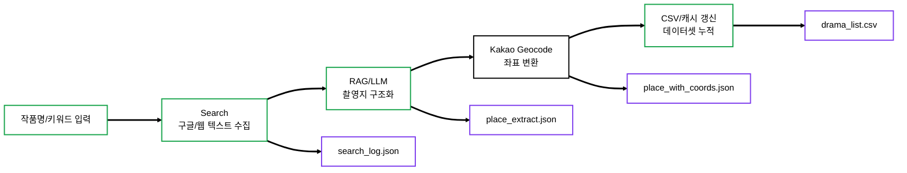
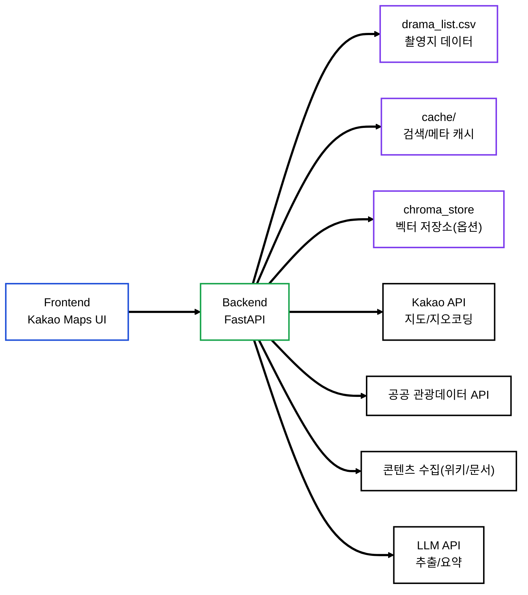
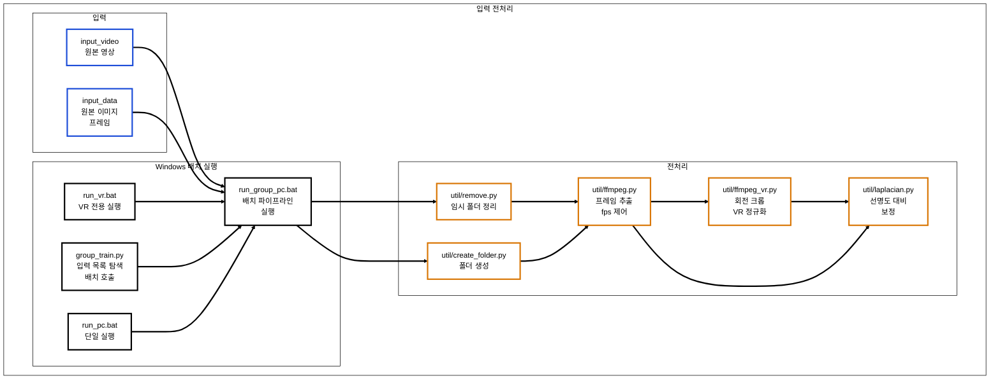

# 🎬 KHT — RAG 기반 K-Drama 관광 플랫폼


> **드라마 텍스트/검색 결과에서 촬영지를 RAG로 자동 추출하고, 공공 관광데이터와 매칭해 “성지순례 코스”를 지도 UI로 제공하는 웹 플랫폼**입니다.  
> 검색(작품/배우/지역/키워드) → 촬영지 탐색 → 주변 관광지 추천 → 지도 시각화 → 코스 추천까지 한 흐름으로 구성했습니다.

🏆 **2025 한국관광데이터 활용 공모전 장려상** (프로젝트 성과에 맞게 유지/수정)

<br/>

## 📸 Project Showcase

> 아래 이미지는 예시입니다. 레포에 `samples/` 폴더를 만들고 캡처 이미지를 넣어주세요.


- Demo URL: https://app.magiclab.kr/  *(운영 URL이 다르면 수정)*

<br/>

## 📝 Introduction

드라마 팬들이 촬영지를 찾을 때 정보는 기사/블로그/위키 등 **비정형으로 흩어져** 있고,  
정확한 장소(좌표)와 여행 동선(코스)으로 이어지기 어렵습니다.

KHT는 비정형 텍스트에서 촬영지를 **RAG로 구조화**하고,  
**지오코딩(좌표화) + 공공 관광데이터 매칭**을 통해 지도 기반으로 탐색/추천을 제공하는 서비스입니다.

### Key Features
- **RAG 기반 촬영지 추출**: 검색 결과 텍스트에서 촬영지 후보를 구조화(장소명/근거/작품 메타)
- **좌표화(Geocoding)**: Kakao Geocode로 촬영지를 위경도로 변환
- **주변 관광지 매칭**: 공공 관광데이터(관광지/숙소/맛집)를 거리/카테고리 기반으로 추천
- **Kakao Maps UI**: 지도 마커/리스트/상세 팝업 연동
- **코스 추천 UX**: 촬영지 중심으로 여행 동선을 구성하도록 코스 후보 제공
- **데이터 누적/갱신**: 추출 결과를 CSV/캐시로 누적하여 재사용 가능하게 관리

<br/>

## 🏗 System Architecture

### 1) 데이터 파이프라인 (촬영지 추출 → 좌표화 → 데이터셋 갱신)



### 2) 서비스 아키텍처 (Web UI ↔ FastAPI ↔ Data/API)



<br/>

## 🛠 Tech Stack

| Category              | Technology                    | Description                |
| --------------------- | ----------------------------- | -------------------------- |
| **Frontend**     | HTML / CSS / Vanilla JS	          | 검색/필터/리스트/팝업 UI   |
| **Map**          | Kakao Maps JS API                 | 지도 마커/상세 팝업/좌표 기반 탐색          |
| **Backend**        | FastAPI (Python)	      | 검색/추천/챗봇/근처 추천 API |
| **RAG**    | 검색 + LLM + 구조화	       | 촬영지 후보 추출 및 근거 기반 정리               |
| **Data** | CSV / JSON / Cache	 | 데이터 누적, 재현성, 빠른 로딩       |
| **Vector Store**               | (옵션)	                  | 유사도 기반 검색/증강                      |	
 	

<br/>

## 📝 Introduction
본 프로젝트는 3D 재구성(3D Gaussian Splatting) 과 2D 스타일 변환(CycleGAN 계열) 을 하나의 워크플로우로 묶어,
입력 데이터(영상/프레임)를 넣으면 전처리 → 스타일링 → COLMAP 기반 재구성 → 3DGS 학습 → 결과 저장까지 자동으로 수행합니다.

### Key Features
- **Batch Orchestration (Windows .bat)**: 데이터별 반복 실행을 위한 배치 파이프라인 구성 (run_group_pc.bat)
- **Frame Preprocessing**: ffmpeg 기반 fps 제어 프레임 추출 + VR 입력 회전/크롭 정규화 + 선명도/대비 보정
- **Style Transfer (CycleGAN)**: 스타일 추론 및 후처리(마스크/침식/블러)로 입력 이미지 품질 정리
- **3D Reconstruction (COLMAP + 3DGS)**: convert.py로 sparse 생성 후 train.py로 3DGS 학습
- **Structured Outputs**: PLY/SPLAT/MP4 산출물을 목적별 디렉터리로 분리 관리

<br/>

## 🏗 System Architecture (Data Pipeline)

1) 입력/오케스트레이션/전처리



2) 스타일 변환/3D 재구성/출력

```mermaid
%%{
  init: {
    'flowchart': { 'nodeSpacing': 50, 'rankSpacing': 100, 'arrowMarkerAbsolute': true, 'arrowMarkerSize': 20 },
    'theme': 'base',
    'themeVariables': {
      'primaryColor': '#ffffff',
      'primaryTextColor': '#000000',
      'primaryBorderColor': '#000000',
      'lineColor': '#000000',
      'secondaryColor': '#ffffff',
      'tertiaryColor': '#ffffff',
      'background': '#ffffff',
      'mainBkg': '#ffffff',
      'nodeBorder': '#000000',
      'clusterBkg': '#ffffff',
      'clusterBorder': '#000000',
      'defaultBkg': '#ffffff',
      'titleColor': '#000000',
      'edgeLabelBackground':'#ffffff',
      'fontSize': '16px'
    }
  }
}%%

flowchart LR

classDef PreStyle fill:#ffffff,stroke:#d97706,stroke-width:3px,color:#000000;
classDef MLStyle fill:#ffffff,stroke:#16a34a,stroke-width:3px,color:#000000;
classDef OutputStyle fill:#ffffff,stroke:#7c3aed,stroke-width:3px,color:#000000;

subgraph Lane2["스타일 변환<br/>3D 재구성 출력"]
direction LR

subgraph StyleTransfer["스타일 변환<br/>CycleGAN 계열"]
direction LR
StTest["styleTransfer/test.py<br/>스타일 추론"]:::MLStyle
StConvert["styleTransfer/test_convert.py<br/>마스크 후처리"]:::MLStyle
StConvert2["styleTransfer/test_convert_2.py<br/>결과 정리"]:::MLStyle
end

subgraph Retarget["입력 리타게팅<br/>3DGS 포맷 정합"]
direction TB
PilPy["util/pil.py<br/>root 기준 정합<br/>input 구성"]:::PreStyle
end

subgraph GaussianSplatting["3D 재구성<br/>(3D Gaussian Splatting)"]
direction LR
GsConvert["gaussian-splatting/convert.py<br/>COLMAP sparse"]:::MLStyle
GsTrain["gaussian-splatting/train.py<br/>3DGS 학습"]:::MLStyle
GsSave["gaussian-splatting/scene/save<br/>PLY SPLAT 저장"]:::MLStyle
end

subgraph Outputs["출력"]
direction TB
OutputList["output_list<br/>PLY 목록"]:::OutputStyle
OutputData["output_data<br/>산출물"]:::OutputStyle
OutputMp4["output_data/*.mp4<br/>렌더 결과"]:::OutputStyle
end

end

StTest --> StConvert --> StConvert2
StConvert2 --> PilPy
PilPy --> GsConvert --> GsTrain --> GsSave
GsSave --> OutputList
GsSave --> OutputData
OutputData --> OutputMp4

linkStyle default stroke-width:3px,stroke:black;

```




## 🛠 Tech Stack

| Category              | Technology                    | Description                |
| --------------------- | ----------------------------- | -------------------------- |
| **Orchestration**     | Windows Batch (.bat)          | 배치 실행/옵션 분기/폴더 규약 기반 자동화   |
| **Language**          | Python 3.8+                   | 전처리/스타일/파이프라인 제어           |
| **Preprocess**        | ffmpeg, OpenCV, Pillow        | fps 제어 프레임 추출, 이미지 보정/리사이즈 |
| **Style Transfer**    | PyTorch (CycleGAN 계열)         | 스타일 추론 및 후처리               |
| **3D Reconstruction** | COLMAP, 3D Gaussian Splatting | sparse 생성 + 3DGS 학습        |
| **GPU**               | CUDA 11.8+                    | 학습 가속                      |

<br/>

## 📂 Implementation Details

### 1. Shooting Location Extraction (RAG)
* 드라마/배우/키워드 기반으로 웹 문서(검색 결과)를 수집하고, LLM을 통해 촬영지 후보를 구조화합니다.
* 추출 결과는 근거 문장/출처를 함께 남겨 검증 가능하도록 JSON/캐시 형태로 저장합니다.

### 2. Geocoding + Dataset Build
* 추출된 촬영지 텍스트를 Kakao Geocode로 좌표(위경도)로 변환합니다.
* 변환된 결과를 기존 데이터셋(CSV)에 병합하여 촬영지 데이터가 누적/갱신되도록 구성합니다.

### 3. Map-based Recommendation Service
* FastAPI 서버가 촬영지/주변 관광지 추천 API를 제공하고, 프론트는 Kakao Maps로 마커·리스트·상세 오버레이를 연동합니다.
* 거리/카테고리 조건을 기반으로 촬영지 주변 관광 데이터를 매칭하여 “성지순례” 탐색 흐름을 완성합니다.
  
<br/>

## 🧩 What I Built (기술 구현 요약)
* RAG 기반 촬영지 구조화 파이프라인: 비정형 텍스트 → 촬영지 엔티티 추출 → 근거/출처 포함 저장
* 좌표화 및 데이터셋 누적 구조: 지오코딩으로 위경도 부여 후 CSV/캐시 기반으로 결과를 재사용 가능하게 관리
* 지도 중심 서비스 UX: FastAPI API + Kakao Maps UI로 탐색/추천/상세정보 흐름을 웹에서 구현
  
<br/>

## 🏆 Project Outcomes
* 비정형 드라마 정보(문서/검색 결과)를 좌표 기반 촬영지 데이터셋으로 전환하는 프로세스를 확립했습니다.
* 촬영지와 공공 관광데이터를 연결하여, 팬 관점의 “성지순례”를 실제 여행 탐색 UI(지도/리스트)로 구현했습니다.
* 2025 한국관광데이터 활용 공모전 장려상 수상 성과를 프로젝트 결과로 제시할 수 있습니다.
  
<br/>

## 🚀 How to Run
외부 API(Kakao/관광데이터/LLM) 키가 필요합니다. 아래는 “구조를 이해하고 실행하는” 기준의 최소 안내입니다.
1. Clone this repository.
 ```bash
  git clone https://github.com/wns5255/KHT-main.git
  cd KHT-main
 ```

2. (권장) Python 가상환경 준비
 ```bash
  python -m venv .venv
  # Windows
  .venv\Scripts\activate
  # macOS/Linux
  # source .venv/bin/activate
  pip install -r requirements.txt
 ```

3. 환경 변수 설정 (.env 생성)
 ```bash
  KAKAO_REST_API_KEY=YOUR_KAKAO_REST_API_KEY
  KAKAO_JS_API_KEY=YOUR_KAKAO_JS_API_KEY
  TOUR_API_KEY=YOUR_TOUR_API_KEY
  LLM_API_KEY=YOUR_LLM_API_KEY
 ```

4. 실행
 ```bash
  uvicorn server:app --host 0.0.0.0 --port 8000 --reload
 ```

5. 촬영지 데이터 파이프라인 실행
 ```bash
  python main_pipeline.py
 ```
    
<br/>

## ⚠️ Notes
API 호출 제한(쿼터)과 키 설정 상태에 따라 결과가 달라질 수 있습니다.
로컬 경로/캐시 디렉터리 구조가 고정되어 있다면, 운영 환경에서는 config/.env 기반으로 경로를 분리하는 리팩토링을 권장합니다.

<br/>

## ⚖️ License

**Copyright (c) Soongsil University. All Rights Reserved.**

This project was developed as part of a curriculum or research at **Soongsil University**.
The intellectual property and copyright of this software belong to **Soongsil University**.
Unauthorized commercial use or distribution is prohibited.


